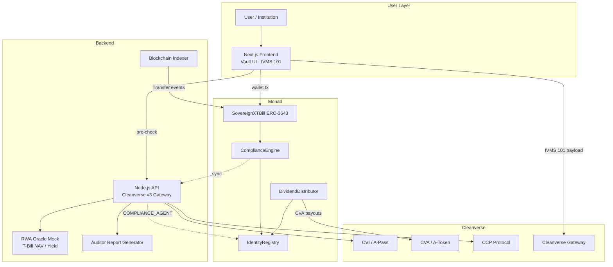

# SovereignX Architecture

> **Core security guarantee:** Toxic liquidity is mathematically impossible. Every transfer, mint, and burn is cryptographically gated by ERC-3643 compliance modifiers. Failed CCP validation atomically reverts — assets remain in the sender's compliant wallet. No forced transfer. No admin override.

## Mission

SovereignX (SOVX) bridges institutional TradFi security with Web3 liquidity by tokenizing fractionalized US Treasury Bills ($10 minimum) on **Monad**, with mandatory **ERC-3643** permissioned transfers and **Cleanverse** CVI/CVA compliance.

## High-Level System Diagram



## Transaction Flow (User A → User B)

1. **Frontend:** User A initiates `transfer(SOVX)` and optionally runs CCP pre-check via API.
2. **IVMS 101:** For transfers ≥ $3,000, frontend constructs IVMS 101 payload for Cleanverse Gateway.
3. **On-chain:** `SovereignXTBill.transfer()` invoked on Monad.
4. **Modifiers (atomic):**
   - `onlyVerifiedSender(A)` — CVI active, not sanctioned, tier ≥ min
   - `onlyVerifiedReceiver(B)` — CVI verified, not sanctioned
   - `withComplianceRules` — `ComplianceEngine.canTransfer(A, B, amount)`
   - `withFailureStateSafety` — revert on any failure; balance unchanged
5. **Off-chain (parallel):** API queries Cleanverse `/query_apass`, `/validator/verify` for global AML.
6. **Success:** Transfer executes; indexer captures `Transfer` event; auditor logs attestation.
7. **Failure (sanctioned wallet):** Full revert. SOVX remains in User A's wallet.

## Smart Contracts

| Contract | Standard | Role |
|----------|----------|------|
| `SovereignXTBill` | ERC-3643 | Permissioned SOVX token, $10 fractions |
| `IdentityRegistry` | ERC-3643 | On-chain CVI mirror (UUPS) |
| `ComplianceEngine` | ICompliance | CCP rules, tier/country gates |
| `DividendDistributor` | Custom | CVA-only dividend payouts |
| `SovereignXProxy` | UUPS | Upgradeable proxy wrapper |

### Compliance Modifiers

```solidity
// Implemented as internal checks + ComplianceEngine.canTransfer
onlyVerifiedSender   → registry.isVerified(sender) && !sanctioned
onlyVerifiedReceiver → registry.isVerified(receiver) && !sanctioned
withComplianceRules  → compliance.canTransfer(from, to, amount)
withFailureStateSafety → revert CCPValidationFailed; no state change
```

### Parallelization (Monad)

- Transfer path uses isolated `balances[address]` storage slots (no global mutex).
- `ComplianceEngine.transferred()` is intentionally no-op to avoid cross-tx contention.
- `nonReentrant` on external entrypoints only.

## Backend Services

| Service | Port | Responsibility |
|---------|------|----------------|
| `@sovereignx/api` | 4000 | Cleanverse integration, CCP pre-check, oracle, audit |
| `@sovereignx/indexer` | 4001 | Monad `Transfer` event indexing |

### Cleanverse API Integration

- Base: `https://uatapi.cleanverse.com/api/cooperate`
- Auth: `api-id` header + AES encryption for sensitive writes
- Key endpoints: `/query_apass`, `/validator/verify`, `/download_travel_rule`

## Frontend

- **Theme:** `#002D62` (blue), `#00A36C` (green), dark navy vault aesthetic
- **Components:** Asset blocks, CVI/CVA widget, Verified Interaction Cursor, IVMS 101 viewer

## Deployment

```bash
# Contracts → Monad testnet
cd contracts && forge script script/Deploy.s.sol --rpc-url monad_testnet --broadcast

# Backend + Frontend
pnpm install && pnpm dev
```

## Testing Focus

- Standard mint/transfer between verified wallets
- Revert on unverified receiver
- Revert on sanctioned sender (failure state safety)
- Below-min-fraction enforcement ($10)
- Forced transfer disabled
